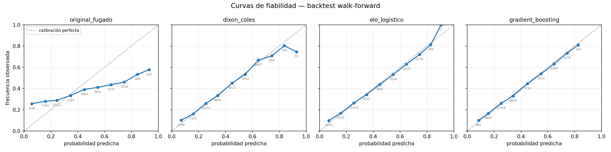

# Resultados del backtest

Evaluación honesta de modelos de predicción 1X2 sobre las cinco grandes ligas
europeas.

**Reproducir:**

```bash
python scripts/run_backtest.py --start 2019-08-01 --refit-days 7
python scripts/significance.py
```

---

## Diseño experimental

| | |
|---|---|
| Datos | 14.379 partidos, EPL / La Liga / Serie A / Bundesliga / Ligue 1, 2018-08 a 2026-08 |
| Fuentes | Kaggle (2018-2023) + Understat en vivo (2023-2026), unificadas en un esquema común |
| Burn-in | Temporada 2018 completa (sólo entrenamiento, nunca se predice) |
| Evaluación | 12.553 partidos, 2019-08-01 a 2026-08-31 |
| Método | Walk-forward con ventana expansiva, reajuste cada 7 días |
| Garantía | Cada predicción usa **exclusivamente** partidos anteriores a su fecha |

El `train_test_split` aleatorio del modelo original entrenaba con partidos de
2023 para predecir 2019. Aquí eso es imposible por construcción, y hay un test
(`tests/test_backtest.py`) que falla si el entrenamiento invade el futuro.

---

## Resultados

Ordenado por RPS. **Menor es mejor** en RPS, log-loss, Brier y ECE.

| modelo | RPS | log-loss | Brier | ECE | acierto | skill RPS |
|---|---|---|---|---|---|---|
| **gradient_boosting** | **0.2016** | 0.9919 | **0.5908** | 0.0095 | 52.3% | **+12.7%** |
| **elo_logistico** | 0.2019 | **0.9916** | 0.5909 | 0.0113 | **52.4%** | +12.6% |
| **dixon_coles** | 0.2026 | 0.9959 | 0.5921 | **0.0085** | 52.2% | +12.3% |
| tasa_base | 0.2309 | 1.0747 | 0.6505 | 0.0020 | 43.1% | 0.0% |
| uniforme | 0.2357 | 1.0986 | 0.6667 | 0.0000 | 43.1% | −2.1% |
| **original_fugado** | **0.2558** | 1.1932 | 0.7059 | **0.1041** | 42.2% | **−10.8%** |

*skill RPS = mejora porcentual sobre `tasa_base` (la frecuencia histórica de
local/empate/visitante). Un valor negativo significa que el modelo es peor que
no tener modelo.*

### Significancia estadística

Bootstrap de bloques semanales, 10.000 repeticiones, sobre el RPS por partido.
Los partidos de una misma jornada están correlacionados, así que se remuestrean
semanas enteras y no partidos sueltos.

| comparación | diferencia de RPS | IC 95% | |
|---|---|---|---|
| gradient_boosting vs elo_logistico | −0.0003 | [−0.0012, +0.0007] | **no significativa** |
| gradient_boosting vs dixon_coles | −0.0010 | [−0.0022, +0.0002] | **no significativa** |
| elo_logistico vs dixon_coles | −0.0007 | [−0.0015, +0.0001] | **no significativa** |
| gradient_boosting vs tasa_base | −0.0293 | [−0.0314, −0.0270] | significativa |
| tasa_base vs original_fugado | −0.0249 | [−0.0277, −0.0221] | significativa |
| uniforme vs original_fugado | −0.0201 | [−0.0230, −0.0171] | significativa |

Los tres modelos reales son **indistinguibles entre sí**. Los tres baten a las
referencias con holgura. Y el modelo original es significativamente peor que
responder 1/3 a cada resultado.

> Con 7.203 partidos de evaluación (sólo el tramo de Kaggle), la ventaja del
> gradient boosting sobre Dixon-Coles *sí* salía significativa. Al ampliar a
> 12.553 partidos dejó de serlo. Es un recordatorio útil: una diferencia de
> 0.002 en RPS necesita mucha muestra para distinguirse del ruido.

---

## Los tres hallazgos

### 1. El modelo original era peor que no tener modelo

`original_fugado` (en `golazo/models/legacy.py`) es una réplica fiel del
predictor original. Evaluado honestamente obtiene **RPS 0.2558, peor que asignar
1/3 a cada resultado** (0.2357), y la diferencia es estadísticamente
significativa.

La causa es doble y estaba en el código:

- **Fuga de datos**: entrenaba con `h_shot`, `h_shotOnTarget`, `h_deep` y
  `h_ppda` **del mismo partido** cuyo resultado predecía.
- **Desajuste entrenamiento/producción**: al predecir sustituía esas variables
  por las del *último* partido de cada equipo. Correlación con los goles del
  local: **0.589 en entrenamiento, 0.133 en producción**. Aprendía de una señal
  4,4 veces más fuerte que la que después recibía.

Su calibración lo confirma:

| decía | ocurría | n |
|---|---|---|
| 93% | **58%** | 255 |
| 84% | 53% | 804 |
| 65% | 44% | 2.272 |
| 6% | **26%** | 3.140 |

Sobreconfiado arriba, infraconfiado abajo. Un ECE de 0.1041 frente al 0.0085 de
Dixon-Coles.

### 2. Una regresión sobre una sola variable iguala al gradient boosting

`elo_logistico` es una regresión logística multinomial sobre **una única
feature**: la diferencia de Elo. `gradient_boosting` usa **44 features** (medias
móviles de xG, ppda y deep a 5 y 10 partidos, forma como local y como
visitante, días de descanso, liga) con árboles y early stopping.

La diferencia es **−0.0003 de RPS, con el intervalo cruzando el cero**.

No significa que las features no sirvan: significa que casi toda la señal
disponible ya está condensada en la fuerza relativa de los equipos, y el Elo la
captura con un número. Es un resultado que conviene tener antes de invertir
semanas en ingeniería de features.

### 3. Se sirve Dixon-Coles, y no el que encabeza la tabla

Los tres empatan. Dixon-Coles es el único que produce la **distribución conjunta
de marcadores**, y de ella se derivan de forma coherente 1X2, over/under, ambos
marcan, hándicap asiático y marcador exacto. Los otros dos sólo dan 1X2.

Además tiene la mejor calibración de los tres (ECE 0.0085):

| dice | ocurre | n |
|---|---|---|
| 15.9% | 15.9% | 5.251 |
| 25.4% | 25.8% | 14.155 |
| 44.8% | 45.0% | 4.222 |
| 64.4% | 66.6% | 1.907 |
| 83.7% | 80.2% | 329 |

Cae sobre la diagonal en todo el rango con muestra suficiente. El último bin
(92.9% → 74.5%) tiene sólo 55 casos y es ruido.

`scripts/train.py --model elo_logistico` sirve el otro si sólo se quiere 1X2.

---

## Decisiones que costaron precisión, y cuánto

Dos cambios de la Fase 2 se midieron antes de adoptarlos, sobre el mismo tramo
de evaluación de 7.203 partidos:

| cambio | motivo | coste en RPS |
|---|---|---|
| ClubElo → Elo propio | la API externa responde 502 y el fichero termina en 2023 | +0.0007 |
| quitar tiros y tiros a puerta | Understat no los publica; mantenerlos reintroduce el desajuste train/serve | (incluido arriba) |

Ambos juntos: **0.0007 de RPS**, menor que la diferencia entre modelos que ya
sabemos que es ruido. A cambio, el sistema no depende de nadie y puede predecir
partidos de mañana.

El Elo propio correlaciona 0.973 con ClubElo y predice prácticamente igual
(0.429 vs 0.437 de correlación con la diferencia de goles).

---

## Curvas de fiabilidad



Un modelo calibrado cae sobre la diagonal: cuando dice 60%, acierta 60 de cada
100 veces. Los números bajo cada punto son el tamaño del bin.

---

## Qué NO demuestra esto

- **No se ha comparado con las cuotas del mercado.** Batir a las casas de
  apuestas es un problema distinto y mucho más difícil; nada aquí sugiere que
  este modelo lo consiga.
- **No es un historial.** Un backtest lo diseña uno mismo y siempre se puede
  ajustar hasta que salga bien. El historial de predicciones firmadas antes de
  cada partido está en [track_record.md](track_record.md) y es el único
  resultado que no admite retoque.
- **No es consejo para apostar.** Proyecto educativo.
